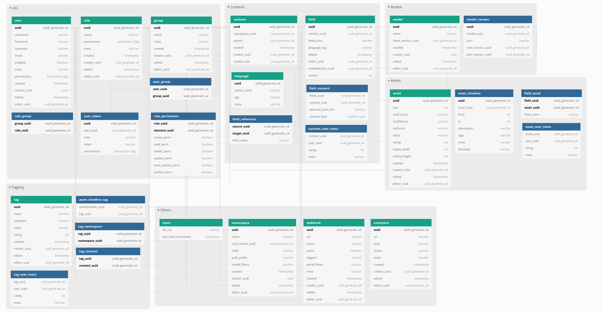

:icons: font
:source-highlighter: prettify

## Basics

For Loom I knew what kind of building blocks were required since it is basically just a continuation of my work on Mesh.

In the past I choose the approach to generate the spec and database schema from code. At least for the database that seemed a good choice at the time since the embedded DB of Mesh could be directly controlled via Java.

This time I'll however decided to handle things differently. First I want to define the API specification and from that information I would derive the needed domain model.

Let's take a look at the building blocks first.

## Assets

The assets are the key component of Loom around various other elements are arranged.

Properties:

* `uuid`
* `filename`
* `hashes.sha512`, `hashes.sha256`, `hashes.md5`
* `mimeType`
* `dominantColor`
* `duration`
* `timeline.from`, `timeline.to`
* `timeline.thumbnail`
* `timeline.meta`
* `timeline.tags`
* `timeline.description`
* `location.lon`, `location.lat`
* `meta`
* `creator.username`, `creator.uuid`
* `editor.username`, `editor.uuid`
* `cdate`, `edate`
        
## ACL

Additionally an `ACL` system is needed which consists of `User`, `Group`, `Role` and permission management.

### SSO

Loom does not directly participate a typical OAuth flow since it is only a third party consumer of OAuth tokens.

Instead a frontend app must handle the OAuth flow and process the SSO authentication. After that has been done the generated API token can be used for Loom requests as well.

Loom can now validate the token using the public keys from the SSO provider.
Next the `JWT` public claims can be utilized to map the information to a Loom user which is needed to perform the request.

For all options it is a good idea to prepared the domain model in order to support link:https://en.wikipedia.org/wiki/Single_sign-on[Single-Sign-On]. For Loom this means that a user model also has a `sso` flag which indicates that the user was created via SSO process.

#### Option 1 - In-memory user mapping

In order to avoid cluttering the Loom database with SSO users it would be one option to use an in-memory user instead of creating and persisting the user in the database. Downside of this approach is that newly created or edited resources can't store the user reference.

#### Option 2 - Surrogate user mapping

Another approach is to map the SSO user to a surrogate user which acts as a stand-in for SSO users. This approach however only works if the users don't need dedicated permissions.

#### Option 3 - Dedicate mapping

Finally the SSO token information can be mapped directly to a dedicated Loom users. This way individual permissions and creator/editor references can be stored in Loom.

### Permissions

## Tagging

Taggings can be applied to assets, contents, namespaces.

Often taggings are user based and thus it is a good choice to store tags globally and on a per-user basis.

## Namespaces

`Namespaces` are used to scope content and asset elements.

## Content Models

`Content Models` are used to define the structure of your content elements.
A model defines a list of fields which can hold the content information.
`Field` types can be numbers, dates, JSON, text, booleans.

## Contents

The `Content` are elements which can be created in order to supplement the information from the assets.

## API Functions / OpenAPI

https://editor.swagger.io/

.openapi.xml
[source,xml]
----
openapi: '3.0.2'
info:
  description: "Central Loom REST API"
  version: "1.0.0"
  title: "MetaLoom Loom API"
  termsOfService: "https://metaloom.io/terms/"
  contact:
    email: "api@metaloom.io"
  license:
    name: "Apache 2.0"
    url: "http://www.apache.org/licenses/LICENSE-2.0.html"
servers:
  - url: https://demo.metaloom.io/v1
tags:
- name: "namespace"
  description: "The namespace within a loom instance."
  externalDocs:
    description: "Find out more"
    url: "https://metaloom/docs/namespaces"

security:
  - ApiKeyAuth: []

paths:
  # User
  /users:
    summary: "Endpoint to access users."
    head:
      tags: ["User"]
      operationId: "checkUsers"
      responses:
        '204':
          description: "Users checked"
    get:
      parameters: 
        - $ref: "#/components/parameters/perPage"
        - $ref: "#/components/parameters/page"
      tags: ["User"]
      operationId: "loadUsers"
      responses:
        '200':
          description: "Users loaded"
          content:
            'application/json':
              schema:
                $ref: '#/components/schemas/UserListResponse'
              examples:
                UserListResponse:
                  $ref: '#/components/schemas/UserListResponse/example'
…
----

link:openapi.yaml[Full OpenAPI Spec]

### Resource Identifier

For the resource identifier in API paths (`/users/:uuid`) I choose link:https://en.wikipedia.org/wiki/Universally_unique_identifier#Version_4_(random)[UUIDv4].

In some situations using UUIDs can be complicated for the client. Tags are a good example for this.
A frontend may interact with the Loom backend using tag names instead of UUIDs.

A resource path that matches `/tagsByName/:tagName` would thus be more convenient.

### HTTP Methods

The REST API CRUD methods should not be be directly mapped to HTTP methods. The usage of the method must match the link:https://datatracker.ietf.org/doc/html/rfc2616#section-9.3[RFC2616].

A good resource on this topic is link:https://restfulapi.net/http-methods/[restfulapi.net].

[options="header",cols="1,2"]
|======

| Method
| Description

| `GET`
| Load the resource/s (idempotent)

| `POST`
| Create a new resource 

| `PATCH` 
| Partial update of a resource

| `HEAD`
| Check the resource/s without returning the content

| `PUT`
| Update / create resource with id

| `DELETE`
| Delete the resource

|======

Note that POST requests are not idempotent and thus may create multiple elements when invoked multiple times.

For Loom I'm however considering to omit `PATCH` and use `POST` for partial updates. This does not validate the RFC and simplifies the API.

### REST Models

The OpenAPI spec also contains the response and request format.

.openapi.xml
[source,xml]
----
…
UserResponse:
    allOf:
    - $ref: "#/components/schemas/EditableElement"
    required:
    - username
    properties:
    uuid:
        type: string
        description: "UUID of the user."
    username:
        type: string
        description: "Username of the user."
    firstname:
        type: string
        description: "Firstname of the user."
    lastname:
        type: string
        description: "Lastname of the user."
    email:
        type: string
        description: "E-Mail address of the user."
    enabled:
        type: boolean
        description: "Flag which indicates that the user is enabled."
    admin:
        type: boolean
        description: "Flag which indicates that the user has admin permissions."
    meta:
        type: object
        description: "Additional user properties."
    example:
    uuid: "217f8c981ada4642bf8c981adaa642c3"
    username: "joedoe"
    email: "joedoe@metaloom.io"
    firstName: "Joe"
    lastName: "Doe"
    enabled: true
    admin: false
    meta:
        birthday: "02-04-1987"
        favoriteColor: "blue"
        securityQuestionAnswer: "42"
    creator:
        username: "joedoe"
        uuid: "eaf23fea-f6b2-46a7-84af-a7335471df5e"
    editor:
        username: "joedoe"
        uuid: "2e20fca1-dbe7-4f28-99d7-15bf366b4a82"
    cdate: "2021-03-20T20:12:01.084Z"
    edate: "2021-03-20T21:12:01.084Z"
…
----

### Pagination

Implementing an efficient paging solution can be a challenge in itself. Often many parameters need to be taken into account when retrieving a page of elements for a specific resource.

For loom the result of a page request can be affected by:

* applied filters
* user permissions
* page selection
* sort order

It is thus desired to generate database queries which all include these factors. The database can in turn cache the query and return the resulting page of elements.

There are two different paging options that are common:

#### Limit & offset based - `/users?offset=10&limit=2`

In this option you need to manually specify how many items you want to skip and afterwards select.
It is easy to map these parameters to the needed SQL query. This option is however not very convenient when using the REST API for a web frontend which usually exposes pages to the users.

#### Page size based - `/users?perPage=10&page=2`

In this option page size and selected page need to be specified by the user.
The offset and limit can derived from these parameters.

* `perPage * page = offset`
* `perPage = limit`

### Response Caching / eTag Handling

Caching is an important aspect that is rarely mentioned when designing a REST API.
In this section I'll mention a few aspects that influence caching.

#### Foreign values

Whenever the response of a resource contains fields from foreign elements it can negatively affect the cacheability.

The element needs to be flushed from the cache whenever an included value of a foreign element is altered in the response. This not only affects client side caches but also the eTag generation for responses.

.group-response
[source,xml]
----
{
  "uuid" : "fbfd0632-7d10-464f-ada4-ebe5511d226d",
  "creator" : {
    "firstName" : "Joe",
    "lastName" : "Doe",
    "uuid" : "89389d87-6af3-43ed-8374-23cda00c3750"
  },
…
  "name" : "Admin Group",
  "roles" : [ {
    "name" : "admin",
    "uuid" : "8cb8c1c0-7a32-4b27-a15b-d28819ae5952"
  } ]
}
----

Including foreign values can't or should not always be avoided. This is mainly a design and usability decision.
In this example the role names and uuid are included. Whenever the role name changes the cached group response needs to be invalidated / the eTag in the response needs to change.

#### Inclusion of immutable foreign values

Another option is to omit the mutable value from the referenced resource. This reduces the probability that the cache needs to be updated. It however may also increase the *burden on the API user* since additional resources may need to be manually fetched afterwards. This aspect is called link:https://stackoverflow.com/a/44568365/644326[underfetching].

Needless to say that link:https://graphql.org/[GraphQL] does solve the fetching aspect in a great way.

.group-response
[source,xml]
----
…
  "roles" : [ {
    "uuid" : "8cb8c1c0-7a32-4b27-a15b-d28819ae5952"
  } ]
…
----

#### ETag handling

Returning an link:https://en.wikipedia.org/wiki/HTTP_ETag[ETag] is a good practice for REST APIs as it with helps client and proxy caching.

The ETag itself is a hash which needs to be computed for the requested resource.

Adding a `version` column on each resource table can help a lot with the generation of the ETag.
The value of the column for the element needs to be incremented whenever it gets updated.
Using this value it is easy to compute a hash by selecting all `version` values that influence the response.
A group response which also returns the role names must thus also include the role version's in the ETag.
Server side caching can be used to store computed hashes in order to avoid database queries.
For Mesh I created an event aware caching implementation which could invalidate server-side caches across a clustered setup. For Loom this might also be a good option.

#### Caching of page responses

Including the `totalCount` and `pageCount` values in the response can also negatively affect caching since the response needs to be invalidated when ever new elements get added/removed which may alter the counts.

.page-response
[source,xml]
----
{
  "data" : [ … ],
  "_metainfo" : {
    "currentPage" : 1,
    "perPage" : 2,
    "pageCount" : 10,
    "totalCount" : 20
  }
}
----

Alternatively it is also possible to just include information whether there are further pages. This may limit the effect of newly added elements to the resource on caching. The needed SQL select may in theory also be faster since a link:https://en.wikipedia.org/wiki/Full_table_scan[full table scan] can be avoided in this case. The scan would otherwise needed to return the count values.

.page-response
[source,xml]
----
{
  "data" : [ … ],
  "_metainfo" : {
    "currentPage" : 1,
    "perPage" : 2,
    "hasNext" : true,
    "hasPrev" : true
  }
}
----

### Streaming / Time to first byte

Reducing the time to first byte can be a desired feature.

#### Progressive Media

A very typical usecase is the handling of progressive images.
Images which are for example encoded in link:https://en.wikipedia.org/wiki/WebP[WebP] can already be displayed by the client when only a part of the full image data has been loaded.

#### JSON Streaming

Streaming JSON data which was formatted in link:http://ndjson.org/[NDJSON] can also desired when handling large bulk responses. The server side response handling gets a bit more complicated since individual entries need to be encoded and flushed to the connected client.

Returning paged response data in this way could improve the responsiveness of client applications.
A reactive server design in combination with result streaming from a source database can allow this kind of streaming in an efficient way. Streaming the data also reduces the memory footprint of request processing since the full result in not kept in memory at one time. Instead only the currently retrieved database entry needs to be processed at one time.

## Domain Model / Database Design

Each main building block gets a dedicated table `group`, `role`, `user`.

Relations between elements are stored in individual cross tables (e.g. `user_role`, `user_group`)

